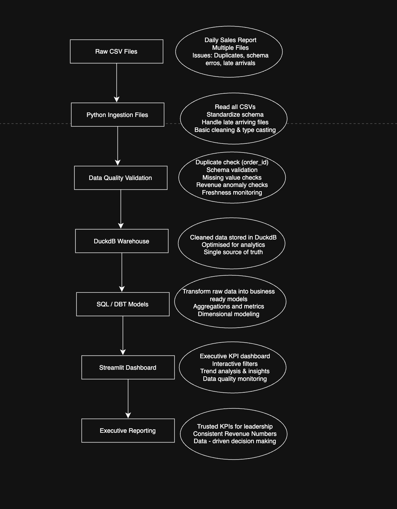

# Revenue Intelligence Platform

Trusted executive reporting platform built using Python, DuckDB, SQL transformations, Streamlit, and modular data quality validation.

---

## Live Dashboard

https://streaming-sales-pipeline-dpcvh8tegeqy5ucipundey.streamlit.app/

---

## Problem Statement

Different business teams were calculating different revenue numbers from the same raw sales files.

Finance, Operations, Product, and Leadership all reported conflicting metrics because:
- revenue logic was inconsistent
- duplicate records existed
- late-arriving files were ignored differently
- no centralized validation layer existed

The goal of this project was to create:
- one trusted revenue source
- explainable reporting
- automated data quality monitoring
- executive-ready dashboards

---

## Architecture Diagram



---

## Dashboard Preview


---

## Key Features

### Data Ingestion
- Recursive CSV ingestion
- Late-arriving file support
- Standardized revenue calculation
- Idempotent reruns

### Data Quality Validation
- Schema validation
- Duplicate detection
- Missing value checks
- Freshness monitoring
- Revenue anomaly monitoring

### Warehouse Layer
- DuckDB analytical warehouse
- Clean trusted reporting tables
- SQL / DBT-style transformations

### Executive Dashboard
- Revenue KPIs
- Revenue trends
- Moving average analysis
- Regional contribution
- Product intelligence
- Data quality monitoring

---

## Tech Stack

| Layer | Technology |
|---|---|
| Ingestion | Python |
| Validation | Pandas |
| Warehouse | DuckDB |
| Transformations | SQL / DBT-style models |
| Dashboard | Streamlit |
| Visualization | Plotly |

---

## Repository Structure

```text
streaming-sales-pipeline/
│
├── dashboard/
├── data/
├── docs/
├── forecasting/
├── ingestion/
├── notebooks/
├── quality_checks/
├── scripts/
├── transformations/
├── warehouse/
├── DECISIONS.md
├── README.md
└── requirements.txt